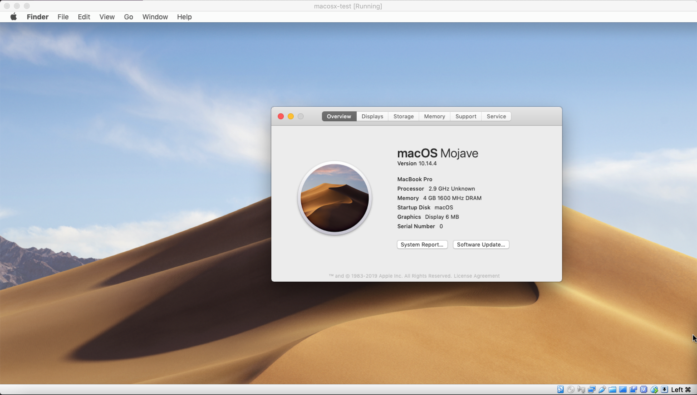

# vagrant-macosx

Example of a working Vagrantfile running MacOSX on MacOS, Windows & Linux hosts  

Just run a `vagrant up` and you should be able to see something like:

## Links

There are no official boxes, but some home brewn ones - like: https://app.vagrantup.com/yzgyyang/boxes/macOS-10.14

Running MacOS in VirtualBox: https://techsviewer.com/install-macos-10-14-mojave-virtualbox-windows/

https://wiki.archlinux.org/index.php/VirtualBox/Tips_and_tricks#Install_MacOS_guest

https://gist.github.com/WayneBuckhanan/15de1bb8b3fb3bd4f7af